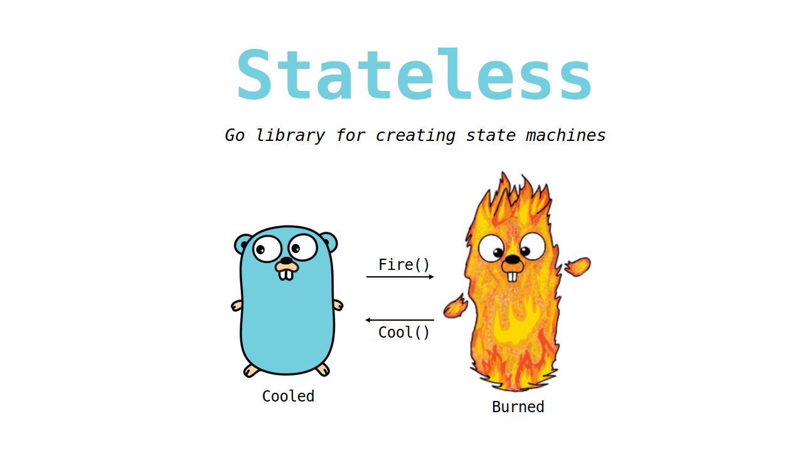
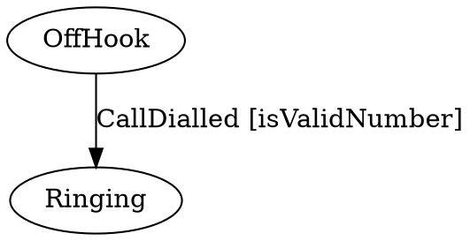

<p align="center"></p>

<p align="center">
    <a href="https://pkg.go.dev/github.com/qmuntal/stateless?tab=doc"></a>
    <a href="https://github.com/qmuntal/stateless/actions/workflows/test.yml"></a>
    <a href="https://coveralls.io/github/qmuntal/stateless"></a>
    <a href="https://goreportcard.com/report/github.com/qmuntal/stateless"></a>
    <a href="https://opensource.org/licenses/BSD-2-Clause"></a>
    <a href="https://github.com/avelino/awesome-go"></a>
</p>

# Stateless

**Create *state machines* and lightweight *state machine-based workflows* directly in Go code:**

```go
phoneCall := stateless.NewStateMachine(stateOffHook)

phoneCall.Configure(stateOffHook).Permit(triggerCallDialed, stateRinging)

phoneCall.Configure(stateRinging).
  OnEntryFrom(triggerCallDialed, func(_ context.Context, args ...any) error {
    onDialed(args[0].(string))
    return nil
  }).
  Permit(triggerCallConnected, stateConnected)

phoneCall.Configure(stateConnected).
  OnEntry(func(_ context.Context, _ ...any) error {
    startCallTimer()
    return nil
  }).
  OnExit(func(_ context.Context, _ ...any) error {
    stopCallTimer()
    return nil
  }).
  Permit(triggerLeftMessage, stateOffHook).
  Permit(triggerPlacedOnHold, stateOnHold)

// ...

phoneCall.Fire(triggerCallDialed, "qmuntal")
```

This project, as well as the example above, is almost a direct, yet idiomatic, port of [dotnet-state-machine/stateless](https://github.com/dotnet-state-machine/stateless), which is written in C#.

The state machine implemented in this library is based on the theory of [UML statechart](https://en.wikipedia.org/wiki/UML_state_machine). The concepts behind it are about organizing the way a device, computer program, or other (often technical) process works such that an entity or each of its sub-entities is always in exactly one of a number of possible states and where there are well-defined conditional transitions between these states.

## Features

Most standard state machine constructs are supported:

* Support for states and triggers of any comparable type (int, strings, boolean, structs, etc.)
* Hierarchical states
* Entry/exit events for states
* Guard clauses to support conditional transitions
* Introspection

Some useful extensions are also provided:

* Ability to store state externally (for example, in a property tracked by an ORM)
* Parameterised triggers
* Reentrant states
* Thread-safe
* Export to DOT graph

### Hierarchical States

In the example below, the `OnHold` state is a substate of the `Connected` state. This means that an `OnHold` call is still connected.

```go
phoneCall.Configure(stateOnHold).
  SubstateOf(stateConnected).
  Permit(triggerTakenOffHold, stateConnected).
  Permit(triggerPhoneHurledAgainstWall, statePhoneDestroyed)
```

In addition to the `StateMachine.State` property, which will report the precise current state, an `IsInState(State)` method is provided. `IsInState(State)` will take substates into account, so that if the example above was in the `OnHold` state, `IsInState(State.Connected)` would also evaluate to `true`.

### Entry/Exit Events

In the example, the `StartCallTimer()` method will be executed when a call is connected. The `StopCallTimer()` will be executed when call completes (by either hanging up or hurling the phone against the wall.)

The call can move between the `Connected` and `OnHold` states without the `StartCallTimer()` and `StopCallTimer()` methods being called repeatedly because the `OnHold` state is a substate of the `Connected` state.

Entry/Exit event handlers can be supplied with a parameter of type `Transition` that describes the trigger, source and destination states.

### Initial state transitions

A substate can be marked as initial state. When the state machine enters the super state it will also automatically enter the substate. This can be configured like this:

```go
sm.Configure(State.B)
  .InitialTransition(State.C);

sm.Configure(State.C)
  .SubstateOf(State.B);
```

### External State Storage

Stateless is designed to be embedded in various application models. For example, some ORMs place requirements upon where mapped data may be stored, and UI frameworks often require state to be stored in special "bindable" properties. To this end, the `StateMachine` constructor can accept function arguments that will be used to read and write the state values:

```go
machine := stateless.NewStateMachineWithExternalStorage(func(_ context.Context) (stateless.State, error) {
  return myState.Value, nil
}, func(_ context.Context, state stateless.State) error {
  myState.Value  = state
  return nil
}, stateless.FiringQueued)
```

In this example the state machine will use the `myState` object for state storage.

### Activation / Deactivation

It might be necessary to perform some code before storing the object state, and likewise when restoring the object state. Use `Deactivate` and `Activate` for this. Activation should only be called once before normal operation starts, and once before state storage.

### Introspection

The state machine can provide a list of the triggers that can be successfully fired within the current state via the `StateMachine.PermittedTriggers` property.

### Guard Clauses

The state machine will choose between multiple transitions based on guard clauses, e.g.:

```go
phoneCall.Configure(stateOffHook).
  Permit(triggerCallDialled, stateRinging, func(_ context.Context, _ ...any) bool {
    return IsValidNumber()
  }).
  Permit(triggerCallDialled, stateBeeping, func(_ context.Context, _ ...any) bool {
    return !IsValidNumber()
  })
```

Guard clauses within a state must be mutually exclusive (multiple guard clauses cannot be valid at the same time). Substates can override transitions by respecifying them, however substates cannot disallow transitions that are allowed by the superstate.

The guard clauses will be evaluated whenever a trigger is fired. Guards should therefor be made side effect free.

### Parameterised Triggers

Strongly-typed parameters can be assigned to triggers:

```go
stateMachine.SetTriggerParameters(triggerCallDialed, reflect.TypeOf(""))

stateMachine.Configure(stateRinging).
  OnEntryFrom(triggerCallDialed, func(_ context.Context, args ...any) error {
    fmt.Println(args[0].(string))
    return nil
  })

stateMachine.Fire(triggerCallDialed, "qmuntal")
```

It is runtime safe to cast parameters to the ones specified in `SetTriggerParameters`. If the parameters passed in `Fire` do not match the ones specified it will panic.

Trigger parameters can be used to dynamically select the destination state using the `PermitDynamic()` configuration method.

### Ignored Transitions and Reentrant States

Firing a trigger that does not have an allowed transition associated with it will cause a panic to be thrown.

To ignore triggers within certain states, use the `Ignore(Trigger)` directive:

```go
phoneCall.Configure(stateConnected).
  Ignore(triggerCallDialled)
```

Alternatively, a state can be marked reentrant so its entry and exit events will fire even when transitioning from/to itself:

```go
stateMachine.Configure(stateAssigned).
  PermitReentry(triggerAssigned).
  OnEntry(func(_ context.Context, _ ...any) error {
    startCallTimer()
    return nil
  })
```

By default, triggers must be ignored explicitly. To override Stateless's default behaviour of throwing a panic when an unhandled trigger is fired, configure the state machine using the `OnUnhandledTrigger` method:

```go
stateMachine.OnUnhandledTrigger( func (_ context.Context, state State, _ Trigger, _ []string) {})
```

### Export to DOT graph

It can be useful to visualize state machines on runtime. With this approach the code is the authoritative source and state diagrams are by-products which are always up to date.

```go
sm := stateMachine.Configure(stateOffHook).
  Permit(triggerCallDialed, stateRinging, isValidNumber)
graph := sm.ToGraph()
```

The StateMachine.ToGraph() method returns a string representation of the state machine in the DOT graph language, e.g.:



This can then be rendered by tools that support the DOT graph language, such as the dot command line tool from graphviz.org or viz.js. See [webgraphviz.com](http://www.webgraphviz.com) for instant gratification. Command line example: dot -T pdf -o phoneCall.pdf phoneCall.dot to generate a PDF file.

This is the complete Phone Call graph as builded in `example_test.go`.


## Project Goals

This page is an almost-complete description of Stateless, and its explicit aim is to remain minimal.

Please use the issue tracker or the if you'd like to report problems or discuss features.

(_Why the name? Stateless implements the set of rules regarding state transitions, but, at least when the delegate version of the constructor is used, doesn't maintain any internal state itself._)
